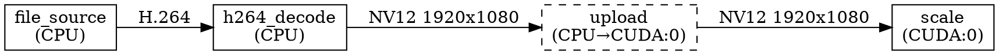

# Observability

## Structured Logging

### Logger Interface

All framework components and filters log through a central logger:

```cpp
ctx.log(LogLevel::Info, "Opened input file: {}", path);
ctx.log(LogLevel::Warn, "Discarding corrupt frame at PTS {}", pts);
```

At the C ABI boundary:

```c
void sdream_log(SDreamLogLevel level, const char* filter_name,
                const char* fmt, ...);
```

### Severity Levels

| Level | Meaning |
|-------|---------|
| `Trace` | Very verbose internal state (frame-by-frame). Off by default. |
| `Debug` | Detailed diagnostic information useful during development. |
| `Info` | Normal operational events (graph started, filter loaded). |
| `Warn` | Non-fatal anomaly (frame dropped, parameter clamped). |
| `Error` | Failure that affects output quality or correctness. |
| `Fatal` | Unrecoverable — graph will shut down. |

### Per-Filter Verbosity

The logger supports per-filter log level overrides:

```cpp
graph.set_log_level("h264_decode", LogLevel::Trace);
graph.set_log_level("*", LogLevel::Warn);  // everything else
```

### Log Sinks

The application registers one or more log sinks:

- **Console** (stderr, with color).
- **File** (rotating log files).
- **Callback** (application-defined handler for integration with external
  logging systems).

---

## Graph Visualization

### DOT Export

The framework exports the graph as a Graphviz DOT description:

```cpp
std::string dot = graph.export_dot(DotOptions{
    .show_physical = true,    // include auto-inserted transfer/converter filters
    .show_formats  = true,    // annotate links with negotiated MediaType
    .show_devices  = true,    // color-code filters by device
});
```

Example output:



Auto-inserted filters are rendered with dashed borders.

---

## Profiling

### Per-Suspension-Point Timestamps

Every `co_await` records a timestamp pair: when the coroutine suspended and
when it was resumed. From these, the framework computes:

| Metric | Description |
|--------|-------------|
| **Active time** | Time the filter was actually executing (between resume and next suspend). |
| **Wait time** | Time spent suspended (waiting for input, output capacity, buffers). |
| **Frames processed** | Count of frames pushed to output pins. |
| **Average frame time** | Active time / frames processed. |

### Per-Link Metrics

| Metric | Description |
|--------|-------------|
| **Queue occupancy** | Average and peak number of frames in the queue. |
| **Stall count** | Number of times a producer was suspended due to full queue. |
| **Throughput** | Frames per second transiting this link. |

### Per-Device Metrics

| Metric | Description |
|--------|-------------|
| **Transfer volume** | Total bytes transferred to/from this device. |
| **Transfer time** | Cumulative DMA/copy time. |
| **Compute utilization** | Fraction of wall time the device was busy (if queryable). |

### Trace Export

An optional tracing backend emits events compatible with Chrome's
`chrome://tracing` format (Trace Event Format JSON). This gives a timeline
visualization of every filter's execution, suspension, and GPU work:

```json
[
  {"name":"scale","ph":"B","ts":1000,"pid":0,"tid":2},
  {"name":"scale","ph":"E","ts":1500,"pid":0,"tid":2},
  {"name":"pull(0)","ph":"B","ts":1500,"pid":0,"tid":2,"cat":"wait"},
  {"name":"pull(0)","ph":"E","ts":2200,"pid":0,"tid":2,"cat":"wait"}
]
```

Tracing is disabled by default (zero overhead when off). Enabled via:

```cpp
graph.enable_tracing("trace.json");
```

### Runtime Stats Query

The application can poll live stats without tracing:

```cpp
auto stats = graph.stats();
for (auto& f : stats.filters) {
    printf("%s: %d frames, %.1f ms/frame avg\n",
           f.name, f.frames_processed, f.avg_frame_time_ms);
}
```
